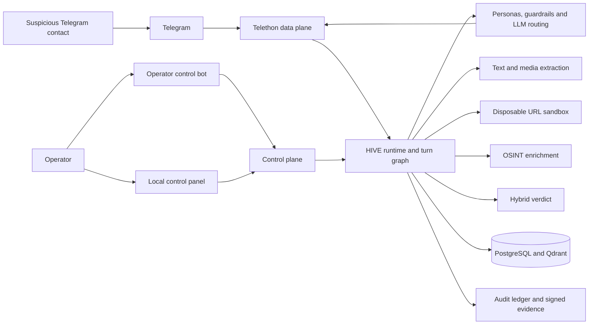
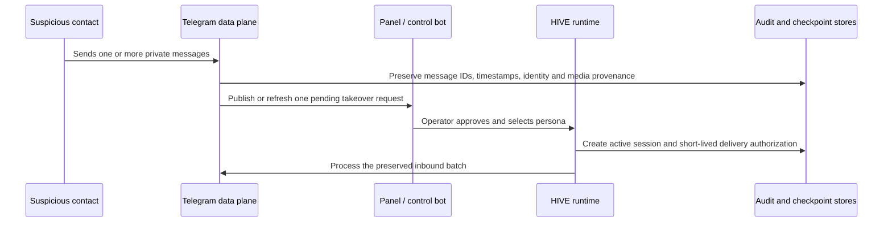
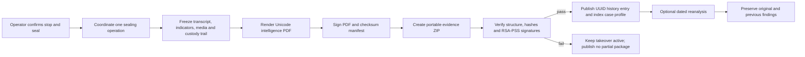

<p align="center"></p>

# HIVE - Honeypot for Intelligence, Verdict & Evidence

HIVE is a local-first Telegram anti-scam research prototype. An operator can approve a
suspicious private chat, let HIVE respond through a controlled Malaysian persona, inspect
the resulting indicators and sandbox findings, and seal the case as a signed forensic
evidence package.

HIVE is response-only: it does not discover targets, initiate conversations, transfer money,
submit credentials, report cases automatically, or contact a suspicious party without an
operator-approved takeover and a captured inbound Telegram message.

The implemented prototype is feature-complete for its research scope: local deployment,
operator-controlled Telegram engagement, human-behaviour middleware, multilingual
extraction and scoring, disposable URL inspection, cross-case pattern retrieval, permanent
auditing, historical analysis, and signed evidence production. Remaining work is described
under [Future enhancements](#future-enhancements) and is not required for the current
prototype workflow.

> Final Year Project research prototype. Use HIVE only with authorised accounts, synthetic
> scenarios, and an approved ethics/testing procedure. Its verdicts and OSINT results are
> investigative signals, not declarations of guilt. Its evidence controls support integrity
> and authentication; they do not guarantee legal admissibility.

<p align="center"></p>

## Research objectives

HIVE is implemented around three measurable objectives:

1. Design a Human-Emulation Layer that uses variable response latency and multilingual
   modelling in English and Mandarin to sustain deceptive engagement with incoming scam
   actors.
2. Implement a response-only agent architecture with a sandboxed forensic logging
   environment that documents suspicious messages, mule-account references, multimedia
   material, and social-engineering tactics.
3. Evaluate HIVE through controlled testing of character-break rate, threat indicators
   extracted per session, and forensic-log integrity with hashing that supports Section 90A
   authentication.

Manglish/code-switching is also supported as a Malaysian conversation style, while Bahasa
Malaysia remains future work.

## What makes HIVE distinctive

| Specialty                               | Implemented approach                                                                                                                                                                                   |
| --------------------------------------- | ------------------------------------------------------------------------------------------------------------------------------------------------------------------------------------------------------ |
| Operator-gated, response-only operation | A Telegram userbot may reply only within an approved takeover and under a short-lived authorization tied to the active peer, session, and captured inbound message IDs.                                |
| Human-like conversation pacing          | HIVE batches rapid inbound messages, selects a contextual fast/normal/slow pace, waits and types before delivery, and sends compact thoughts as separate chat bubbles.                                 |
| Multilingual persona consistency        | Four Malaysian personas operate in English, Mandarin, and Manglish. HIVE records expected language, observed reply language, alignment, planned delay, and actual delivery delay.                      |
| Forensics from the first message        | Trigger messages, identity observations, original timestamps, Telegram IDs, media, extracted indicators, model decisions, delivery events, and operator actions retain source provenance.              |
| Safe URL investigation                  | Each URL is inspected in a short-lived Scrapling browser container with public-address enforcement, redirect/subresource checks, a read-only filesystem, dropped capabilities, and cleanup on timeout. |
| Evidence rather than screenshots alone  | Every sealed case produces a PDF, detached RSA-PSS signature, signed checksum manifest, embedded public key, original attachments, and an offline-verifiable `.evidence.zip`.                          |
| Exact facts separated from similarity   | PostgreSQL stores authoritative cases and exact shared-identifier relationships. Qdrant stores privacy-reduced vectors only for candidate scam-pattern retrieval.                                      |
| Reproducible evaluation                 | Versioned scenarios, personas, repeats, raw results, summary metrics, signed evidence, declared denominators, and a checksum inventory support controlled assessment.                                  |

## Feature catalogue

### Telegram operation and takeover control

- Telethon data plane connected to the approved Telegram account.
- Telegram Bot API control plane restricted to `HIVE_OPERATOR_ID`.
- One pending takeover request per eligible private contact; later messages update the same
  request instead of creating duplicate alerts.
- Approve or dismiss requests from the web panel or the operator bot.
- Interactive operator-bot controls for pending takeovers, status, persona selection,
  stop-and-seal, and confirmation of consequential actions.
- Four selectable personas:
  - `confused_elderly`
  - `naive_young_adult`
  - `overseas_worker`
  - `small_business_owner`
- Live persona changes, supervised resume/recovery, and explicit stop-and-seal actions.
- Automatic benign hand-back only after at least ten conversational exchanges; the operator
  is notified when control returns.
- Safety budgets pause delivery without silently sealing or discarding the case.
- Panel and bot operations use the same coordinator, preventing duplicate seal operations.
- Live synchronization keeps panel and Telegram-side actions consistent without requiring a
  manual page reload.

### Human-Emulation Layer

- English, Mandarin, Manglish, and mixed-language detection.
- Reply-language alignment checks without rewriting the model's words.
- A bounded recent transcript plus deterministic validated facts from the current session;
  active conversation messages are not stored as embeddings.
- Persona-biased phone-check timing for rapid-message bursts.
- Contextual `fast`, `normal`, and `slow` response pacing.
- Separate, human-sized reply bubbles rather than multiline model-formatted messages.
- Typing indicators limited to the visible typing portion of the delay.
- Model inference time deducted from the remaining planned human delay.
- Mid-reply steering when new messages arrive before a draft is delivered.
- Planned and observed delivery timing retained in the audit trail.
- Prompt-injection and bot-probe screening before persona generation.

### Extraction, verdict, and media analysis

- Regex and multilingual GLiNER extraction with source-message provenance.
- A versioned YAML knowledge registry controls GLiNER labels and confidence thresholds,
  Malaysian bank aliases, account-number context, name boundaries, stopwords, and
  English/Mandarin/Manglish phrases without requiring model fine-tuning.
- Each analysis records the knowledge version and SHA-256 fingerprint used, so later replay
  or reanalysis remains attributable to its extraction configuration.
- Indicators include Malaysian phone numbers, bank names/accounts, account-holder names,
  Telegram handles, URLs, domains, IP addresses, email addresses, and cryptocurrency wallets.
- Local QR decoding and English/Mandarin OCR.
- Optional vision-model fallback when local analysis cannot explain an image.
- Images displayed inline; documents, audio, video, and inert APK fixtures retain filename,
  type, size, checksum, and authenticated access.
- Cumulative hybrid verdict scoring: later low-risk text cannot erase earlier high-confidence
  scam evidence.
- Person names and locations remain available as investigative context but do not independently
  increase scam risk without a separate suspicious behaviour or observable.
- Source-linked hard indicators and model-classified social-engineering tactics.
- High-confidence pipeline findings are labelled `Auto-accepted`; only explicit human review
  is labelled `Operator reviewed` and retains correction provenance.
- Background case reanalysis that creates a new dated analysis instead of overwriting the
  original sealed record.

### Disposable URL sandbox

The Layer 4 runner uses Scrapling's `StealthyFetcher` inside one disposable Docker container
per URL. It records:

- original and final URL;
- redirect chain and destination IP;
- HTTP status and access state;
- TLS certificate age when available;
- page title, body length, and password-field presence;
- blocked requests and challenge detection;
- runtime, engine version, image identity, and sandbox contract;
- screenshot or an explicit screenshot error.

Before a browser starts, HIVE rejects loopback, private, link-local, and internal destinations.
The browser repeats those checks for navigation, redirects, and subresources. The container
uses a read-only root filesystem, temporary writable areas, dropped Linux capabilities,
`no-new-privileges`, a dedicated network, bounded resources, a hard deadline, and forced
cleanup. A challenge or failed inspection is reported as inconclusive/error, never clean.

The Compose prototype runs its sandbox through privileged Docker-in-Docker. This keeps the
browser daemon separate from the host Docker daemon but remains a disclosed prototype
limitation; a hardened deployment should use a dedicated VM or rootless isolation.

### Threat intelligence and case intelligence

HIVE enriches extracted observables through bounded, cached provider adapters:

| Provider   | Observable                                    | Key requirement | Claim boundary                                           |
| ---------- | --------------------------------------------- | --------------- | -------------------------------------------------------- |
| Semak Mule | Malaysian bank account or phone               | None            | A provider result is corroboration, not identity proof.  |
| VirusTotal | Canonical URL or existing APK hash            | API key         | HIVE does not upload an unknown APK.                     |
| AbuseIPDB  | Public destination IP returned by the sandbox | API key         | HIVE does not treat a no-hit result as proof of safety.  |
| RDAP       | Domain/IP registration information            | None            | Registration data may be incomplete or privacy-redacted. |

Normalized findings retain provider, observable, time, status, risk, response digest, and
source provenance. Synthetic evaluation fixtures never call external providers.

For cross-case analysis:

- PostgreSQL remains authoritative for cases, indicators, and exact shared-identifier edges.
- FastEmbed/Qdrant retrieves candidate cases from privacy-reduced scam-pattern vectors.
- Vector text contains validated tactic labels, indicator types, payment channels, sandbox
  traits, and an identifier-redacted external script.
- Script similarity is investigative triage, never proof of common ownership.
- Embedding fingerprints prevent incompatible vectors from being mixed after model changes.

See [Case-vector reindexing](docs/CASE_VECTOR_REINDEX.md) for the controlled rebuild process.

### Evidence vault and auditability

- Append-only JSONL audit ledger with a SHA-256 link to the preceding event.
- PostgreSQL audit mirror with local-ledger recovery when the database is unavailable.
- Exact inbound/outbound messages, prompts, responses, decisions, timings, model roles,
  operator actions, lifecycle transitions, and errors.
- Signed intelligence PDF with case identity, transcript, extracted intelligence,
  social-engineering tactics, sandbox results, reporting guidance, and chain of custody.
- Raster and SVG image previews embedded in the report; original attachments remain in the
  portable package.
- RSA-PSS/SHA-256 detached PDF signature.
- Signed checksum manifest, embedded public key, and signing-key fingerprint.
- Fail-closed publication: rendering/signing failure leaves the takeover active and publishes
  no partial evidence bundle.
- Offline verifier for package structure, checksums, manifest signature, and PDF signature.
- Non-overwriting signing-key rotation with prior keys retained for historical verification.
- Report-only privacy/retention inventory; scans and policy changes do not delete evidence.
- Verified audit backup and isolated restore-drill workflow.

Cryptographic verification proves that packaged bytes match the signed package. It does not,
by itself, prove who controlled the signing key or determine whether a court will admit the
evidence. HIVE therefore describes these controls as supporting Section 90A authentication,
not guaranteeing admissibility.

### Control panel

The local responsive panel provides:

- runtime and dependency readiness;
- pending takeover requests and active/sealed cases;
- conversation, signal, indicator, intelligence, sandbox, report, and timeline views;
- full-page live conversation workspace with inline images and filename/type metadata for
  other captured media, without nested page scrolling;
- chronological case navigation and command search;
- grouped OSINT results and exact-versus-candidate relationship labels;
- UUID4-addressed sealed histories, previous intelligence findings, background reanalysis
  progress, and comparison without overwriting earlier runs;
- evidence downloads and package verification status;
- a curated Activity view backed by important permanent audit events, distinct from the Logs
  view of lower-level diagnostics from the current application process;
- evaluation runs and human character-review workflow;
- setup for models, Telegram, operator bot, intelligence providers, signing, privacy, and
  runtime controls.

Only the Nginx frontend is published to `127.0.0.1:9130`; the backend, PostgreSQL, and Qdrant
remain on the private Compose network.

### Demo Lab and evaluation

Demo Lab exercises the real analysis pipeline without sending Telegram messages. It supports:

- **Scripted scammer** - repeatable fixed message bursts.
- **Model-driven scammer** - fixed opener followed by generated scammer messages.
- **Interactive** - the presenter supplies each scammer message.
- Normal and accelerated playback controls.
- Text, URL, image, document, QR, and inert APK scenarios.
- Isolated synthetic OSINT routing and a controlled provider-backed showcase.
- Conversation, signals, indicators, intelligence, and sandbox tabs matching the case view.
- Results that remain visible until the user changes scenario or refreshes.

The model-driven evaluation runner provides 30 ground-truthed scenarios across investment,
job, parcel, impersonation, romance, e-commerce, and mixed scam patterns:

- 14 English scenarios;
- 13 Mandarin scenarios;
- 3 Manglish scenarios;
- all four personas;
- configurable response-turn horizon and repeat count;
- deterministic sandbox and threat-intelligence fixtures by default;
- raw JSON, flat CSV, aggregate JSON, evidence packages, metadata, and a finalized result
  manifest;
- character-break scoring, language alignment, indicator count, extraction precision, recall
  and F1, verdict accuracy, sandbox outcomes, guardrail flags, chain validity, and evidence
  verification;
- separate provisional automated and human-reviewed character assessments.

Every successful evaluation directory can be checked offline. The verifier rejects an
incomplete scenario/persona/repeat matrix, undeclared artifacts, altered files, invalid
denominators, and failed evidence signatures.

The result manifest is an unsigned SHA-256 inventory: it detects missing or changed artifacts
when retained independently, but it does not authenticate its own author. Each contained
`.evidence.zip` has separate RSA-PSS authentication.

## System architecture



| Layer              | Main modules                                                              | Responsibility                                                                   |
| ------------------ | ------------------------------------------------------------------------- | -------------------------------------------------------------------------------- |
| L1 Human emulation | `src/hive/middleware/`                                                    | Language alignment, bubble splitting, pacing, delay and typing plans             |
| L2 Deceptive agent | `src/hive/agent/`, `src/hive/llm/`                                        | Personas, bounded context, reply generation and model-tier routing               |
| L3 Extraction      | `src/hive/extraction/`                                                    | Regex/GLiNER indicators, QR/OCR and media analysis                               |
| L4 Sandbox         | `src/hive/sandbox/`                                                       | Disposable Scrapling browser, URL controls and observable collection             |
| L5 Evidence        | `src/hive/vault/`, `src/hive/audit.py`                                    | Hash chains, signed PDFs/packages and custody records                            |
| S6 Verdict         | `src/hive/verdict/`                                                       | Cumulative hard/soft signal scoring                                              |
| S7 Safeguards      | `src/hive/guardrails/`, `src/hive/security/`                              | Prompt defence, session encryption and security boundaries                       |
| S8 Runtime         | `src/hive/runtime.py`, `src/hive/orchestrator.py`, `src/hive/transports/` | Session lifecycle, response authorization, Telegram IO and operator coordination |

Session lifecycle:

```text
IDLE -> ARMED -> ACTIVE -> PROBING -> CLOSING -> SEALED
```

Compose deployment:

| Service    | Responsibility                                                       | Host exposure    |
| ---------- | -------------------------------------------------------------------- | ---------------- |
| `frontend` | Nginx static panel and same-origin API proxy                         | `127.0.0.1:9130` |
| `backend`  | FastAPI, HIVE runtime, Telegram transports and sandbox orchestration | Internal only    |
| `postgres` | Cases, transcripts, exact relationships, analyses and audit mirror   | Internal only    |
| `qdrant`   | Privacy-reduced cross-case scam-pattern candidate vectors            | Internal only    |

### Technology stack

| Area                         | Technology                                                          | Role in HIVE                                                                              |
| ---------------------------- | ------------------------------------------------------------------- | ----------------------------------------------------------------------------------------- |
| Backend runtime              | Python 3.11+, FastAPI, Uvicorn, Pydantic Settings                   | Control API, setup, runtime coordination and configuration                                |
| Conversation orchestration   | LangGraph and HIVE's stateful runtime                               | Ordered guardrail, extraction, verdict, sandbox, intelligence and reply stages            |
| Telegram data plane          | Telethon                                                            | Observes eligible private chats and sends only authorised takeover replies                |
| Telegram control plane       | `python-telegram-bot`                                               | Operator-only interactive takeover, status, persona and sealing controls                  |
| LLM integration              | OpenAI-compatible HTTP APIs with cheap/light/strong/vision roles    | Persona generation, steering, behavioural classification and optional vision analysis     |
| Entity extraction            | Regex, GLiNER `urchade/gliner_multi-v2.1`, versioned YAML knowledge | Multilingual indicators with deterministic normalization and confidence filtering         |
| Media analysis               | OpenCV, pyzbar, Tesseract OCR                                       | Local QR decoding and English/Mandarin text extraction before vision fallback             |
| URL analysis                 | Scrapling `StealthyFetcher` with Chromium/Playwright inside Docker  | Disposable public-page inspection with SSRF and container controls                        |
| Authoritative storage        | PostgreSQL 17 via Psycopg                                           | Case history, analysis runs, exact indicators/relationships, checkpoints and audit mirror |
| Semantic candidate retrieval | FastEmbed and Qdrant 1.18                                           | Privacy-reduced cross-case scam-pattern similarity candidates                             |
| Evidence                     | ReportLab, Cryptography, SHA-256 and RSA-PSS                        | Unicode PDF reports, hash chains, detached signatures and portable packages               |
| Control-panel frontend       | React 19, TypeScript 5, esbuild, Nginx                              | Responsive case operations, live updates, history, intelligence and setup views           |
| Packaging and operations     | `uv`, Task, Docker Compose, GitHub Actions                          | Locked dependencies, repeatable commands, four-service deployment and regression gates    |

The text, vision and OSINT providers are configurable external dependencies. PostgreSQL,
Qdrant, the audit ledger and evidence vault remain local in the reference deployment.

## Operational flows

### 1. Takeover approval and activation



Messages received before approval are evidence and session context, but they do not authorize
an outbound response by themselves. Dismissal records the operator decision and sends nothing.

### 2. Inbound batch, analysis and human-like reply

```mermaid
flowchart LR
    Inbound[Captured inbound messages] --> Batch[Quiet-window batching]
    Batch --> Guard[S7 guardrails]
    Guard --> Extract[L3 regex, GLiNER and media extraction]
    Extract --> Verdict[S6 cumulative verdict]
    Extract --> URL{Public URL found?}
    URL -->|yes| Sandbox[L4 disposable sandbox]
    Sandbox --> Intel[Threat-intelligence enrichment]
    URL -->|no| Context[Validated session context]
    Intel --> Context
    Verdict --> Context
    Context --> Agent[L2 persona and model-tier routing]
    Agent --> Pace[L1 pace, bubbles, delay and typing plan]
    Pace --> Steer{New messages arrived?}
    Steer -->|yes| Reconsider[Send, revise, discard or continue]
    Reconsider --> Pace
    Steer -->|no| Authorize[Validate peer, session and inbound authorization]
    Authorize --> Deliver[Telethon delivery]
    Deliver --> Ledger[Permanent audit and active checkpoint]
```



Rapid messages are considered together by default. The model may choose an engaged, ordinary
or slow pace and one to three compact bubbles. If another message arrives while a reply is
pending, the lightweight steering decision can preserve, revise, interrupt or discard the
draft before delivery. Every decision and actual delay is audited.

### 3. Stop, seal and historical analysis



Stop-and-seal is available from both operator channels. Publication is fail-closed: the session
is archived only after rendering, signing, packaging and persistence succeed. Reanalysis adds
a new analysis run and never rewrites the sealed transcript or earlier findings.

### 4. Data authority and cross-case memory

| Data class                                                   | Authoritative location                                                     | Derived or secondary copy                                   |
| ------------------------------------------------------------ | -------------------------------------------------------------------------- | ----------------------------------------------------------- |
| Active checkpoint and delivery authorization                 | PostgreSQL or the configured checkpoint store                              | In-memory runtime state                                     |
| Sealed transcript, indicators and analysis history           | Configured history store (PostgreSQL in Compose) and signed evidence files | Panel projections and reports                               |
| Exact shared bank account, phone, handle or URL relationship | PostgreSQL                                                                 | None; exact facts are never inferred from vector similarity |
| Scam-pattern similarity                                      | Authoritative case profile (PostgreSQL in Compose)                         | Identifier-redacted FastEmbed vector and Qdrant payload     |
| Permanent internal actions and messages                      | Hash-linked JSONL audit ledger                                             | PostgreSQL query mirror                                     |
| Media and evidence packages                                  | Local evidence filesystem                                                  | Authenticated panel downloads                               |

Qdrant is deliberately not conversational memory. It proposes previously encountered cases
with similar tactics, channels and redacted scripts so the operator can investigate a possible
network pattern. PostgreSQL and source-linked evidence remain authoritative, and similarity
alone never establishes common ownership.

## Quick start

### Prerequisites

- Windows/Linux host with Docker Compose; Docker Desktop is used by the current development
  deployment.
- Python 3.11 or newer and [`uv`](https://docs.astral.sh/uv/).
- [`go-task`](https://taskfile.dev/) for the commands below.
- Telegram API credentials from `my.telegram.org` and a BotFather bot token.
- An OpenAI-compatible text/vision endpoint. The example configuration targets Ollama Cloud.
- At least 4 GB available to the backend container plus storage for model caches and evidence.

### Install and configure

```powershell
Copy-Item .env.example .env
uv sync --extra dev
task run
```

Open `http://127.0.0.1:9130` and complete the five setup areas:

1. model routing;
2. Telegram data plane;
3. operator control bot;
4. evidence signing;
5. readiness review and runtime start.

The panel encrypts the Telethon `StringSession` with AES-GCM using an scrypt-derived key.
The plaintext session is never written to disk. The passphrase has no recovery path.

For terminal-only provisioning, configure `.env` and run:

```powershell
task bootstrap
task run
```

Do not commit `.env`, `secrets/`, private signing keys, Telegram sessions, captured media, or
evidence output.

### Verify the deployed stack

```powershell
task services:verify
task models:verify
task sandbox:verify
```

These checks cover PostgreSQL/Qdrant round trips, configured model generation, public sandbox
fetching, private-address rejection, and disposable-container cleanup. See the
[Operational runbook](docs/OPERATIONAL_RUNBOOK.md) for restart, recovery, incident, evidence,
and shutdown procedures.

## Development and testing

Run the panel without Telegram or Docker:

```powershell
task dev
```

Exercise the conversation pipeline without sending Telegram messages:

```powershell
task simulate
task simulate -- --no-ner --send "hello ||| are you there?" --send "pay now"
```

In the simulator, `|||` represents several adjacent messages in one inbound burst. Planned
delays are displayed without waiting.

Run the deterministic quality gates:

```powershell
task lint
task typecheck
task test
task evaluate
task ci
```

The 2 September 2026 local verification passed 47 focused extraction, verdict, and replay
tests. The full suite recorded 489 passes, one environment-gated skip, and one transient
audit-ledger failure that passed on an isolated rerun, plus one upstream test-client
deprecation warning. Repository-wide Ruff,
strict mypy, frontend TypeScript, production frontend build, Compose validation, deterministic
extraction evaluation, PostgreSQL/Qdrant round trips and all configured model probes passed.
The four deployed services were healthy. A cold nested-Docker sandbox capability probe can
exceed its current 30-second verifier timeout even when the same image subsequently verifies
and runs; this reliability limitation is tracked below rather than reported as a successful
acceptance check.

## Controlled evaluation

Run a selected demonstration matrix:

```powershell
task evaluate:redteam -- --max-turns 10 --repeat 1 `
  --scenario job_zh_account `
  --scenario job_en_inert_apk `
  --persona confused_elderly `
  --output evaluation/results/objective-demonstration
```

Run the full 30-scenario, four-persona matrix with repeats when the configured model budget and
execution window permit:

```powershell
task evaluate:redteam -- --max-turns 10 --repeat 3 `
  --output evaluation/results/redteam
```

The full command represents 360 sessions and 3,600 assessed HIVE response turns. It is a
long-running, model-dependent experiment. Every completed session is atomically checkpointed.
If the process is interrupted, resume the exact recorded matrix without rerunning completed
coordinates:

```powershell
task evaluate:redteam -- --resume `
  evaluation/results/redteam/<timestamped-run-directory>
```

The directory's `redteam_progress.json` reports the active coordinate and completed count.
Preserve failures and incomplete runs instead of silently rerunning only unsuccessful cases.

Verify a finalized result directory:

```powershell
uv run python -m hive.redteam.verify_results `
  evaluation/results/redteam/<timestamped-run-directory>
```

Automated character scoring is provisional and may use the same model family as HIVE. A final
academic evaluation should report automated and human-reviewed results separately. The
[binary blind-review form pack](docs/BLIND_HUMAN_REVIEW_FORM_PACK.md) provides six anonymized
HIVE excerpts and a reproducible human-perception-rate calculation; because it has no human
control transcripts, it must not be reported as human-versus-AI classification accuracy.

## Evidence verification

Seal a controlled case from the panel or `/takeovers`, then verify the downloaded portable
package on an independent copy:

```powershell
uv run python -m hive.verify_evidence evidence/<case>.evidence.zip
```

The verifier succeeds only when the package structure, path safety, checksums, signed manifest,
public key, detached signature, and PDF signature all pass. For a negative control, alter only a
copy of a test package and confirm that verification fails; never modify original evidence.

## Repository layout

```text
frontend/                   React/TypeScript control panel
src/hive/
  agent/                    Personas and LLM message construction
  extraction/               Text, QR, OCR and media indicator extraction
  guardrails/               Prompt-injection and bot-probe screening
  llm/                      OpenAI-compatible clients and tier routing
  middleware/               Language and human-emulation pacing
  redteam/                  Controlled scenarios, scoring and result verification
  sandbox/                  Disposable Scrapling browser runner
  security/                 Encrypted Telegram session handling
  transports/               Telethon data plane and Bot API control plane
  vault/                    Evidence rendering, signing and packaging
  verdict/                  Hybrid verdict scoring
  webpanel/                 FastAPI control-plane API
tests/                      Unit, integration and regression tests
evaluation/                 Synthetic corpora, fixtures and retained results
docs/                       Operational, evaluation and FYP working documents
docker/sandbox/Dockerfile   Versioned disposable-browser image
docker-compose.yml          Four-service local deployment
Taskfile.yml                Development and verification commands
```

## Documentation map

| Document                                                             | Purpose                                                                                                                                        |
| -------------------------------------------------------------------- | ---------------------------------------------------------------------------------------------------------------------------------------------- |
| [Complete final-report outline](docs/FYP_FINAL_REPORT_OUTLINE.md)    | Handoff-ready Chapters 1-6 structure, research gap, methods, evaluation matrix, figures, tables, appendices and source map                     |
| [Part 2 plan and gap audit](docs/FYP_PART_2_PLAN_AND_HIVE_GAPS.md)   | Chapters 1-6 corrections, design outline and dated implementation/gap history; update superseded baselines before using it in the final report |
| [Revised 25-test UAT form](docs/HIVE_UAT_Form_25_Tests_revised.docx) | Formal participant checklist and feedback/signature fields                                                                                     |
| [UAT and performance draft](docs/HIVE_UAT_AND_PERFORMANCE_DRAFT.md)  | Chapter 5 protocol, measurement definitions and result templates; reconcile against the revised 25-test form before execution                  |
| [Operational runbook](docs/OPERATIONAL_RUNBOOK.md)                   | Deployment acceptance, restart, recovery, incidents and shutdown                                                                               |
| [Privacy and retention](docs/PRIVACY_AND_RETENTION.md)               | Data flows, protected classes, review policy and unresolved retention decisions                                                                |
| [Signing-key lifecycle](docs/SIGNING_KEY_LIFECYCLE.md)               | Key creation, rotation, retention and historical verification                                                                                  |
| [Audit backup and restore](docs/AUDIT_BACKUP_RESTORE.md)             | Immutable audit snapshot and isolated restore drill                                                                                            |
| [Case-vector reindexing](docs/CASE_VECTOR_REINDEX.md)                | Fingerprint-compatible PostgreSQL-to-Qdrant rebuild                                                                                            |
| [CPU runtime dependencies](docs/CPU_RUNTIME_DEPENDENCIES.md)         | CPU-only Torch and model-cache deployment decision                                                                                             |
| [Static type checking](docs/STATIC_TYPE_CHECKING.md)                 | Python 3.11/mypy compatibility and quality gate                                                                                                |

For the final report, this README is an implementation overview rather than a replacement for
the required academic structure. The report still needs corrected Chapters 1-3, completed
Chapter 4 design/implementation diagrams and screenshots, executed Chapter 5 testing with at
least two techniques and intended users, and Chapter 6 critical evaluation, limitations and
recommendations.

## Known limitations

- The current evidence controls support authenticity/integrity workflows but do not guarantee
  Section 90A admissibility.
- Controlled synthetic and model-driven scenarios are not evidence of effectiveness against a
  representative population of real scammers.
- Provisional automated character scoring is not independent human validation.
- Live behaviour depends on Telegram, the configured model endpoint, and optional OSINT
  providers.
- Cloud text/vision configuration may send conversation or media content to an external model
  provider; the evaluation consent and privacy statement must describe that data flow.
- Privileged Docker-in-Docker is appropriate only for the disclosed local prototype boundary.
- Cloudflare and similar challenges can make a sandbox result inconclusive.
- Qdrant similarity is candidate retrieval, not attribution proof.
- Retention remains report-only; HIVE does not automatically delete signed evidence or audit
  records.
- The local sandbox capability verifier has a fixed 30-second image-probe timeout, while cold
  Docker Desktop/DinD imports can take longer. The deployed backend may therefore become
  healthy after a transient unhealthy period even when the image is valid.
- PostgreSQL tables are created and upgraded through application-owned compatibility logic;
  HIVE does not yet use a general-purpose schema migration framework.
- Automated backend coverage is broad, but the React panel currently relies on TypeScript,
  production-build, API-contract and manual browser validation rather than a dedicated
  component/end-to-end test suite.

## Future enhancements

The following items extend or harden the implemented prototype; they are not presented as
features of the current release.

### Intelligence and model quality

- Fine-tune or distil GLiNER only after a reviewed, versioned multilingual corpus is large
  enough to justify it. The YAML knowledge registry remains the current improvement path.
- Expand the registry and evaluation corpus for Bahasa Malaysia, more code-switching,
  additional banks/payment channels, ambiguous names and anonymised real-world hard cases.
- Add analyst feedback loops that promote reviewed indicator corrections and behaviour labels
  into a candidate knowledge update without silently changing historical analyses.
- Improve cross-case investigation with temporal clustering, infrastructure pivots and
  explainable network views while keeping exact attribution separate from similarity.

### Platform and operator experience

- Add messaging-platform adapters beyond Telegram while preserving the same response-only
  authorization and custody contracts.
- Add dedicated React component and browser end-to-end regression suites for setup, takeover,
  live media, stop-and-seal, history, reanalysis and recovery.
- Expand accessibility testing, responsive-device coverage, notification controls and
  investigator-oriented exports.
- Support optional human approval of drafted replies for higher-risk research protocols.

### Deployment and operations

- Replace privileged Docker-in-Docker with a dedicated sandbox worker, rootless runtime,
  microVM or isolated host and centrally enforced egress policy.
- Make cold-start, health-check and sandbox-probe timeouts configurable and observable.
- Introduce versioned PostgreSQL migrations, tested rollback/forward procedures and explicit
  release compatibility checks.
- Add coordinated PostgreSQL dumps, Qdrant snapshots, evidence manifests, encrypted secret
  escrow decisions and documented recovery-point/recovery-time objectives.
- Implement supervisor-approved retention enforcement, per-case export, legal holds and
  backup-aware secure disposal without weakening audit continuity.

### Evaluation and governance

- Conduct blinded human persona-realism and character-break review separately from automated
  model judging.
- Run authorised end-to-end Telegram media, restart-recovery and sustained-concurrency trials
  against a recorded frozen build.
- Expand UAT/SUS participation under the approved ethics scope and document cloud-model data
  processing explicitly.
- Obtain formal review of reporting guidance, Section 90A wording and evidence-handling
  procedures. Cryptographic integrity must remain distinct from legal admissibility.

## Responsible use

Use synthetic identifiers, reserved `.example` URLs, inert fixtures, and authorised Telegram
accounts during development and evaluation. Do not upload unknown malware, submit credentials,
transfer funds, impersonate a real person, or use HIVE for harassment or unsolicited contact.
Preserve original evidence separately before performing any tamper-test negative control.

## License

MIT.
