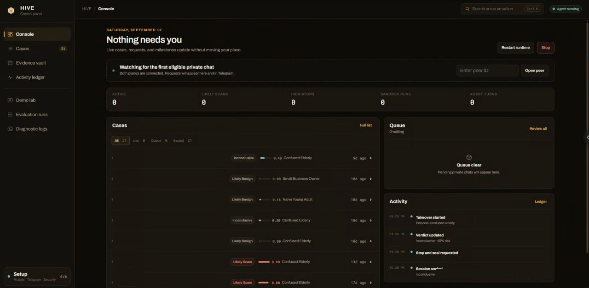

<p align="center"></p>

# HIVE - Honeypot for Intelligence, Verdict & Evidence

HIVE is a research prototype for Telegram anti-scam operations. When an operator
chooses to take over a suspicious chat, HIVE replies as a believable Malaysian
persona, slows the scammer down, extracts High-Value Indicators (HVIs), analyses
links in a disposable browser sandbox, scores the conversation, and produces a
signed evidence bundle.

> Final Year Project. This is not a production service, legal advice, or a tool
> for impersonation or harassment. Use it only for consented anti-scam research
> and evidence preservation.


<p align="center"></p>

## What Is Implemented

- Dual Telegram runtime:
  - Telethon userbot data plane, logged in with the user's encrypted
    `StringSession`.
  - Bot API control plane restricted to `HIVE_OPERATOR_ID`.
- Turn pipeline in `HiveEngine`:
  - S7 prompt-injection and bot-probe screening.
  - L3 regex + optional GLiNER extraction.
  - L4 Playwright-in-Docker URL analysis.
  - Evidence-safe threat-intelligence enrichment through Semak Mule,
    VirusTotal, AbuseIPDB, and RDAP.
  - S6 hybrid verdict scoring.
  - L2 persona reply generation through the cost-tiered LLM router, with
    deterministic continuity from recent messages and validated session facts.
  - Cross-case scam-pattern candidate retrieval through FastEmbed/Qdrant,
    separated from authoritative PostgreSQL exact-identifier relationships.
  - L1 linguistic middleware and tarpit delays.
- Evidence vault:
  - SHA-256 hash chain.
  - ReportLab PDF bundle.
  - RSA-PSS/SHA-256 detached signature.
  - Section 90A certificate template text.
- Safeguards:
  - Encrypted-at-rest Telethon session storage with AES-GCM and scrypt.
  - Early hand-back for likely benign conversations.
  - Prompt defense note injected into the system prompt when S7 flags a probe.
  - Report-only privacy inventory with configurable review thresholds and no
    automatic deletion.
- Offline regression tests for the core pipeline, guardrails, sandbox analysis,
  session encryption, evidence bundle, deterministic session context,
  scam-pattern retrieval, userbot hand-back, and control bot validation.

## Architecture

HIVE has two Telegram planes:

- **Data plane**: `hive.transports.userbot.UserbotTransport`
  connects through Telethon and sends replies as the user's own account for
  chats under active takeover.
- **Control plane**: `hive.transports.control_bot.ControlBot`
  connects through the Telegram Bot API and lets the operator start, inspect,
  and stop takeovers.

The runtime entrypoint is `python -m hive`, which loads settings, decrypts the
Telethon session, builds a `HiveEngine`, starts both transports, and waits on the
Telethon client.

| Layer | Module | Role |
| --- | --- | --- |
| L1 Human emulation | `src/hive/middleware/` | Typo injection, Manglish markers, tarpit delay |
| L2 Deceptive agent | `src/hive/agent/` | Persona prompts, message construction, model-tier routing |
| L3 Extraction | `src/hive/extraction/` | Regex HVIs, optional GLiNER NER, local QR decoding |
| L4 Sandbox | `src/hive/sandbox/` | Disposable Playwright Docker runner and URL verdict signals |
| Threat intelligence | `src/hive/threat_intelligence.py` | Cached external corroboration for extracted accounts, phones, URLs, IPs, domains, and APK hashes |
| L5 Evidence vault | `src/hive/vault/` | Hash chain, PDF bundle, RSA signature |
| Audit ledger | `src/hive/audit.py` | Permanent hash-chained action and message journal |
| S6 Verdict | `src/hive/verdict/` | Hard + soft signal scoring |
| S7 Guardrails | `src/hive/guardrails/`, `src/hive/security/` | Prompt-injection defense and encrypted session storage |
| S8 Runtime | `src/hive/runtime.py`, `src/hive/transports/` | Per-turn orchestration and Telegram IO |

Session state moves through:

```text
IDLE -> ARMED -> ACTIVE -> PROBING -> CLOSING -> SEALED
```

## Repository Layout

```text
src/hive/
  __main__.py              Runtime entrypoint
  config.py                Environment-backed settings
  runtime.py               Integrated per-turn engine
  state.py                 Session, message, HVI, and lifecycle schema
  agent/                   Personas and LLM message assembly
  extraction/              Regex, GLiNER, and media extraction
  guardrails/              Prompt-injection and bot-probe screening
  llm/                     OpenAI-compatible client and tier router
  middleware/              Human-emulation text and delay middleware
  provisioning/            Safe env storage and Telegram login state
  sandbox/                 Docker Playwright URL analysis
  security/                Encrypted Telethon session store
  transports/              Telethon userbot and Bot API control bot
  vault/                   Hash chain, signing, and PDF evidence bundle
  verdict/                 Hybrid scam scoring
tests/                     Offline unit and integration tests
docker/sandbox/Dockerfile  Disposable browser image
frontend/                  Nginx image and backend reverse proxy
docker-compose.yml         Frontend, backend, PostgreSQL, and Qdrant stack
```

## Setup

Prerequisites:

- Python 3.11 or newer.
- Docker, for the sandbox image and optional Qdrant service.
- `uv`, or another Python environment manager.
- Telegram API credentials from `https://my.telegram.org`.
- Telegram Bot API token from BotFather.
- An OpenAI-compatible LLM endpoint. The default config targets Ollama Cloud.

Install dependencies:

```powershell
uv sync --extra dev
```

For panel development, run the localhost-only server with hot reload:

```powershell
task dev
```

This watches the Python and web-panel assets under `src/` and restarts the
panel when they change. It does not auto-start Telegram or run Docker.

To test conversations without repeating the Telegram takeover flow, run the
direct simulator:

```powershell
task simulate
```

Each line is one phone-check exchange. Put `|||` between rapid-fire messages
to deliver them as a single burst, for example `hello ||| are you there?`.
The simulator uses the configured LLM and the real guardrail, extraction,
verdict, persona, deterministic session-context, reply-chunking, case-pattern
guidance, and evidence pipeline, but skips Telegram and shows planned delivery
delays without waiting. Synthetic live profiles are queried but never inserted
into the sealed-case Qdrant index. Useful commands are `/status`, `/history`,
`/seal`, and `/quit`.

Non-interactive checks are also supported, which makes the same harness usable
from automated test runs:

```powershell
task simulate -- --no-ner --send "hello ||| are you there?" --send "pay now"
```

Keep one final Telegram smoke test for takeover, permissions, debounce, and
delivery behavior; those transport concerns are intentionally outside this
simulator.

### Permanent audit ledger

Every HIVE entry point writes one append-only audit stream to
`evidence/audit/events.jsonl`. It includes exact inbound messages, LLM prompts
and responses, case-retrieval operations, pipeline decisions, reply plans, timing and
typing actions, Telegram delivery attempts and results, operator actions,
session lifecycle events, and HIVE runtime logs. Each record is flushed to disk
and linked to the previous record with SHA-256; HIVE refuses to append when the
existing chain fails verification. There is no rotation, expiry, or automatic
deletion.

When `HIVE_DATABASE_URL` is set, the same records are mirrored into PostgreSQL
table `hive_audit_ledger`. A database outage does not lose events: the local
ledger remains authoritative and is resynchronised when PostgreSQL returns.
Compose bind-mounts `./evidence`, so the authoritative ledger survives backend
container replacement, while the database mirror remains in the PostgreSQL
volume.

The panel's Activity page defaults to persistent operator milestones such as
takeovers, verdict changes, newly extracted indicators, sealing, and failures.
Switch it to **All audit events** to inspect the exhaustive ledger. The separate
Logs page is a bounded, redacted, process-local diagnostic stream. Authenticated
integrations can retrieve exact records from `GET /api/audit`, filter with
`after`, `peer_id`, or `event_type`, and verify health at
`GET /api/audit/status`.
`HIVE_AUDIT_PATH` can relocate the journal; auditing is mandatory and has no
runtime off switch.

Create a verified, immutable snapshot with `task audit:backup`. Each backup is
hash-chain checked and accompanied by a manifest containing its source identity,
event count, terminal event hash, and file checksum. Backups are never pruned by
this command.

Exercise that backup with `task audit:restore-drill`. HIVE restores the newest
snapshot into a newly created disposable directory, verifies its checksum,
source identity, hash chain, event count, and terminal hash, then removes only
the isolated copy. A JSON result is retained under
`evaluation/results/backup_restore/`; the live ledger and service stores are not
modified. See [docs/AUDIT_BACKUP_RESTORE.md](docs/AUDIT_BACKUP_RESTORE.md) for
the operator procedure and whole-system recovery limitations.

This ledger deliberately contains third-party messages and model context. Keep
the evidence directory and PostgreSQL backups access-controlled. Diagnostic log
messages redact recognizable credentials, while conversational records remain
exact for auditability. A hash chain makes alteration detectable; independent,
immutable backups are still required to recover from disk loss or deletion.

Start HIVE's localhost control panel:

```powershell
task run
```

Open `http://127.0.0.1:9130`. The same durable panel configures the LLM,
verifies the Bot API token, authorizes the Telethon user account (including
2FA), encrypts its session, and creates the evidence signing key. Telegram
starts automatically once the setup checklist is complete. Credential changes
can be applied by restarting only the managed agent runtime; the panel remains
available throughout.

Threat-intelligence credentials are configured under **Setup → Intelligence**.
Semak Mule and RDAP work without keys. Semak Mule checks extracted Malaysian
bank accounts and phone numbers; VirusTotal checks canonical URLs and existing APK hashes;
AbuseIPDB checks only the public destination IP returned by the sandbox. HIVE
does not upload unknown APKs, and a provider's no-hit result is never presented
as proof that an observable is safe. Normalized findings, query timestamps, and
response digests are retained in the case, hash chain, history, and sealed
evidence report; raw provider responses are not persisted.

HIVE models a person checking their phone rather than reacting to every update.
After the first inbound message it picks a random, persona-biased check time
between 3.5 and 12 seconds, while continuing to collect rapid-fire messages.
It then reasons over the complete burst once. One burst counts as one
conversational exchange for benign hand-back decisions, even though every
original message remains in the evidence record. Tune the check-time bounds
with `HIVE_INBOX_DEBOUNCE_S` and `HIVE_INBOX_MAX_WAIT_S`.

The model selects a hidden `fast`, `normal`, or `slow` pace from the context.
That pace controls both the current read/typing delay and how soon the persona
checks the next burst. Replies default to one compact bubble, use two for a
natural reaction-plus-question, and use three only when needed; verbose model
output is bounded instead of being crammed into the final bubble. Telegram's
typing indicator is shown only for the typing portion of the delay, and model
inference time is deducted from the remaining human delay rather than counted
twice.

If new messages arrive while HIVE is reasoning or waiting to send, a lightweight
steering decision chooses whether a short drafted bubble should be sent first or
whether HIVE should keep thinking with the new context. Unsent drafts never enter
the transcript or evidence chain; each outgoing bubble is recorded only after
Telegram delivery succeeds.

When a new eligible private chat arrives outside an active takeover, HIVE creates
one pending takeover request. It appears in the control panel within the normal
live refresh interval and is pushed proactively to the operator's HIVE Telegram
bot with the sender, peer ID, latest-message preview, and interactive Yes/No
buttons. Yes starts the default persona immediately; No dismisses the request in
both channels.
Further messages update the same request instead of sending duplicate alerts;
starting a takeover resolves it, and a later post-takeover message can create a
new request.

The control bot exposes one operator workflow through `/takeovers`. It lists
active takeovers as buttons; selecting one shows the latest ten messages and
offers persona selection or **Stop & seal**. A second confirmation is required
before HIVE stops replying; the same coordinator used by the panel then archives
the chat, generates the signed report, and sends the PDF back through Telegram.
Concurrent panel and bot seal attempts are rejected instead of producing two
case files.

Active and archived takeover conversations open in a live modal. Telegram
images are shown inline; videos, audio, and other documents retain their
original filename and an authenticated download link. Captured attachments are
kept under `HIVE_MEDIA_PATH`, bounded by `HIVE_MEDIA_MAX_BYTES` per file, and
signal assessments are rendered as labelled scores and evidence instead of raw
JSON. During an active takeover, image analysis overlaps the normal phone-check
delay: HIVE tries local QR decoding and English/Mandarin OCR first, then uses the
configured vision model only when local structured extraction cannot explain
the image. Findings remain linked to the source message and media hash; failures
are audited without blocking a reply.

For headless or terminal-only setup, copy `.env.example` to `.env`, fill in
the required values, then run `task bootstrap` for the interactive Telethon
login and signing key generation.

Active conversations do not write message embeddings. The L2 agent receives a
bounded recent-message window plus a deterministic summary of validated HVIs
from the current stranger. This keeps conversational continuity local to the
session and makes it reproducible without a second copy of the transcript.

```powershell
docker compose up -d qdrant
```

### Cross-case semantic intelligence

Sealing writes a canonical case profile containing the external party's
script, scam method, validated indicators, payment flow, and sandbox findings.
PostgreSQL is authoritative for profiles and exact shared-identifier edges.
Enable the dedicated Qdrant `hive_cases` candidate index with:

```text
HIVE_USE_CASE_SIMILARITY=true
```

The first semantic index operation downloads the configured local multilingual
FastEmbed model into the persistent `hive_fastembed_cache` volume. Sealed and
reanalysed non-benign cases are represented by a privacy-reduced scam vector:
validated tactic labels, identifier types, payment channels, sandbox traits,
and an identifier-redacted external script. During a new takeover, retrieval
starts only after meaningful scam evidence exists. HIVE can use matching
patterns to choose one missing identifier type to ask for, but its prompt
explicitly forbids mentioning prior cases or the investigation.

Semantic similarity is labelled candidate retrieval, not proof of common ownership.
Network attribution must distinguish exact shared identifiers (accounts,
wallets, domains, phone numbers, or Telegram handles), multiple corroborating
features, and script-only similarity. PostgreSQL remains authoritative for
cases and relationship edges; Qdrant finds candidates; the evidence bundle and
audit ledger retain provenance. Only corrected, validated extraction results
enter relationship edges and the index. Person-name similarity never creates a
network edge.

Every point and the collection metadata carry a deterministic embedding
fingerprint covering the FastEmbed version, model, pooling, prefixes,
dimension, and distance. Retrieval rejects unversioned/incompatible indexes
and filters out mismatched points. Rebuild the derived index safely from
authoritative PostgreSQL after an embedding change:

```powershell
docker compose run --rm --no-deps --entrypoint /app/.venv/bin/python backend -m hive.case_reindex --dry-run
docker compose run --rm --no-deps --entrypoint /app/.venv/bin/python backend -m hive.case_reindex
```

See [the case-vector reindex procedure](docs/CASE_VECTOR_REINDEX.md) for the
verification and dependency-upgrade rules.

### Privacy and retention inventory

The panel's **Retention** workspace inventories signed evidence, captured media,
synthetic demos, evaluation results, the audit ledger, unfinished recovery
checkpoints, PostgreSQL records, and Qdrant case-vector points. Configurable
thresholds flag artifacts for operator review only: this release has no delete
endpoint and never removes artifacts during a scan or policy update. Signed
evidence and audit records remain protected classes.

See [docs/PRIVACY_AND_RETENTION.md](docs/PRIVACY_AND_RETENTION.md) for the
default thresholds, data-flow disclosure, access/review procedure, and the
decisions that remain before formal participant testing.

### Operational verification

After starting or restarting the Compose stack, run the live non-destructive
checks:

```powershell
task services:verify
task models:verify
task sandbox:verify
```

See [docs/OPERATIONAL_RUNBOOK.md](docs/OPERATIONAL_RUNBOOK.md) for deployment
acceptance, safe restart/recovery, incident triage, non-destructive evaluation
reset, evidence integrity, and shutdown procedures.

Build the forensic sandbox image:

```powershell
docker build -t hive-sandbox:latest docker/sandbox
```

## Secrets

HIVE expects an encrypted Telethon `StringSession` at
`HIVE_TG_SESSION_PATH` and decrypts it with `HIVE_SESSION_PASSPHRASE`.
The control panel provisions it in the browser; `task bootstrap` provides the
equivalent terminal flow. The session string is never written in plaintext.

The evidence signer expects an RSA private key at `HIVE_SIGNING_KEY_PATH`.
For development, `hive.vault.signer.generate_keypair()` can generate one.
Keep session files, `.env`, private keys, and evidence output out of git.
The Security workspace shows the active public-key fingerprint and supports
non-overwriting rotation only while the agent is stopped. Previous keys are
retained so old packages remain attributable; rotation records both public
fingerprints in the permanent audit ledger and marks the runtime for restart.
See [docs/SIGNING_KEY_LIFECYCLE.md](docs/SIGNING_KEY_LIFECYCLE.md) before
rotating or retiring a key.
Compose stores completed takeover transcripts in PostgreSQL so the control
panel can reopen past chats. `task dev` falls back to local JSON records under
`evidence/history/` when `HIVE_DATABASE_URL` is unset.

Signed intelligence reports use the HIVE logo and charcoal/gold visual system,
embed a CJK-capable font for Mandarin transcripts, and separate the case
summary, conversation, extracted intelligence, sandbox findings, and chain of
custody. Set the optional operator name in the panel (or
`HIVE_OPERATOR_NAME`) to identify the responsible person on the Section 90A
certificate. Each sealed session gets a unique filename. Sealing writes and
signs a temporary report first; if rendering or signing fails, the takeover
stays active and no partial bundle is published.

Each seal also creates a portable `.evidence.zip` beside the PDF. It contains
the report, detached PDF signature, public key, signed checksum manifest, and
offline instructions. Verify a package on a separate machine with:

```powershell
hive-verify evidence/bundle_123_1.evidence.zip
# or, from a source checkout
python -m hive.verify_evidence evidence/bundle_123_1.evidence.zip
```

The command exits successfully only when the package structure, checksums,
manifest signature, and PDF signature all pass. A cryptographic pass shows
that the packaged bytes have not changed since sealing; it does not prove the
sender's identity or guarantee legal admissibility.

## Running

The panel remains available before, during, and after setup:

```powershell
task run
```

Control bot commands:

```text
/chats
/takeovers
/help
```

Valid personas:

```text
confused_elderly
naive_young_adult
overseas_worker
small_business_owner
```

The **Stop & seal** action under `/takeovers` ends the takeover, seals the
evidence bundle under `evidence/`, sends the summary, and attaches the generated
PDF. If the engine decides the chat is likely benign after enough conversational
exchanges, the userbot ends the takeover automatically and notifies the
operator. Verdict risk is cumulative within a takeover, so a quieter later
message cannot erase an earlier high-confidence scam finding.

## Docker Deployment

Compose runs four separate services:

| Service | Responsibility | Host exposure |
| --- | --- | --- |
| `frontend` | Nginx static control panel and same-origin API proxy | `127.0.0.1:9130` |
| `backend` | FastAPI, Telegram runtime, evidence, and sandbox orchestration | Internal only |
| `postgres` | Durable takeover transcripts and history index | Internal only |
| `qdrant` | Cross-case scam-pattern candidate vectors (`hive_cases`) | Internal only |

The backend still runs **Docker-in-Docker** because HIVE spawns disposable
Layer 4 sandbox containers. Its inner daemon remains isolated from the host
daemon.

```powershell
task run                  # build, run, and publish the panel on 127.0.0.1:9130
```

The equivalent Compose command is:

```powershell
docker compose up --build --remove-orphans
```

`--remove-orphans` replaces the legacy single `hive` service container on the
first launch. It does not remove the existing evidence, model cache, Qdrant
data, or named database volumes.

The `backend` container needs `privileged: true` so its inner daemon can run.
On first start the entrypoint launches `dockerd`, builds the `hive-sandbox`
image inside it, then runs `python -m hive`. Nginx proxies `/api/*` and
`/health` to that internal backend. Sealed evidence remains in the mounted
`./evidence` directory, while takeover history is stored in the
`hive_postgres` volume.

GLiNER/Hugging Face model files are stored in the persistent
`hive_model_cache` Docker volume, while cross-case embeddings use
`hive_fastembed_cache`. The first use still downloads the relevant weights,
but later container rebuilds and recreations reuse them. A normal
`task stack:down` preserves the model and PostgreSQL volumes;
`docker compose down --volumes` removes them.

> Security trade-off: a privileged Docker-in-Docker container has broad kernel
> capabilities on the host. This is an accepted cost for a self-contained
> research prototype and is documented here deliberately; a hardened deployment
> would instead use a rootless/sysbox runtime or a dedicated VM. The GLiNER
> dependency also pulls in PyTorch. HIVE pins Torch to the official CPU-only
> wheel index because the Compose deployment does not expose a GPU; this avoids
> packaging unused CUDA runtimes. See
> [the CPU runtime dependency record](docs/CPU_RUNTIME_DEPENDENCIES.md).

## Sandbox Notes

`ScraplingDockerRunner` launches one short-lived Docker container per URL with:

- a dedicated Docker bridge network,
- read-only root filesystem,
- writable `/tmp` tmpfs,
- dropped Linux capabilities,
- no-new-privileges,
- a PID limit and, outside nested Docker, a per-run memory limit,
- a single bind mount for `/out` screenshots.

The runner creates the dedicated Docker network automatically if it is missing.
Before launch it resolves the target and rejects non-public addresses. Inside
the disposable browser, every navigation, redirect, and subresource request is
resolved again and private, loopback, link-local, and internal-name targets are
blocked. Blocked attempts remain visible in the sandbox result.
The browser uses Scrapling's pinned stealth fetcher with Cloudflare challenge
handling enabled. If an interstitial remains after that attempt, HIVE records
the access as `challenge` with an `inconclusive` sandbox signal; challenge pages
are never treated as proof that the destination is clean.
The nested daemon uses the portable `vfs` driver, whose cold container startup
is slower than ordinary Docker; sandbox runs therefore have a 90-second outer
deadline and force-remove their named container on timeout.
Each run receives its own writable screenshot directory, preventing both
non-root permission failures and collisions between concurrent analyses.
Compose cannot apply child memory or PID cgroups reliably inside Docker
Desktop's nested daemon, so the four-service stack disables those child flags
and applies a 4 GB memory and 1024 PID limit to the outer backend container
instead. Set `HIVE_SANDBOX_MEMORY_LIMIT` and `HIVE_SANDBOX_PIDS_LIMIT` only when
the inner daemon supports nested cgroups.
Application-level request filtering is not a substitute for a kernel boundary
against a browser exploit. For defence in depth, add `DOCKER-USER` firewall
rules for the sandbox network subnet, as described by `EGRESS_FIREWALL_HINT` in
`src/hive/sandbox/runner.py`.

## Testing

Run the full suite:

```powershell
uv run pytest -q
```

Measure deterministic indicator precision and recall against the sanitized
English, Mandarin, and Manglish regression corpus:

```powershell
task evaluate
```

The versioned synthetic corpus contains 71 English, Mandarin, Manglish, and
mixed-language cases, including hard negatives, multi-message context, images,
inert document/APK fixtures, and synthetic QR/OCR-derived indicators. Results
are broken down by indicator, language, category, attachment kind, and
development/evaluation split. Fixture validation rejects executable/archive
magic, active SVG content, oversized files, and non-reserved URLs.

Run the model-driven full-pipeline red-team matrix only when you are ready to
use the configured LLM and retain evaluation evidence:

```powershell
task evaluate:redteam -- --output evaluation/results/redteam
```

The default matrix is 19 scenarios across all four personas (76 runs). Each
run uses the complete HIVE graph and seals/verifies an evidence package; raw
JSON, flat CSV, aggregate metrics, and run metadata are retained. Objective 3
now measures character-break rate instead of engagement time or bot accusations.
Remote model outputs can vary, so retain
every final run rather than presenting the command as bit-for-bit deterministic.
The recorder treats every non-empty line in scammer model output as a separate
inbound chat bubble, processes adjacent bubbles as one phone-check burst, and
stores HIVE's actual middleware-planned reply bubbles separately. No retained
transcript message contains several model-formatted paragraphs or list rows.
Automatic extraction precision/recall is calculated against the labelled
scenario opener only. Indicators first disclosed in later generated messages
are retained as additional findings and require post-run human annotation;
they are not automatically misclassified as false positives.
Synthetic scenario URLs use a deterministic sandbox stub by default so the
model evaluation is safe and repeatable. Add `--live-sandbox` only with a
controlled, authorised URL set and a ready disposable-browser environment.
Multimodal openers use the same checksum-addressed fixture registry as Demo Lab;
captured fixture files are included in the signed evidence package manifest.

### Character-break measurement (Objective 3)

The runner defaults to 20 HIVE response turns (`--max-turns` changes the horizon).
Adjacent delivered reply bubbles count as one turn. The configured strong model
assesses the complete transcript **after outbound safeguards**, using the
versioned `hive-character-v1` rubric: identity disclosure, role abandonment,
persona contradiction, history contradiction, instruction compliance, and
sustained persona drift. The exact persona prompt, source hash, judge model,
raw judgment, turn decisions, quoted evidence and explanations are retained.
This is a provisional automated assessment, potentially using the same model
family as HIVE, not independent human validation or real-scammer recognition.

New results contain session/response break rates, first-break turn, assessment
coverage, uncertain turns and per-horizon aggregates. A zero denominator is
unavailable, not 0%. Session rates exclude short, unassessed, failed and uncertain
runs. Different horizons are not pooled. Counts and denominators are retained.
`--no-character-judge` skips the model call and marks the run unassessed.
Model/network/schema errors are recorded as assessment errors, never passes.
Runtime and planned reply latency remain operational diagnostics; neither is
reported as scammer engagement.

In **Evaluation runs**, open a record, inspect **Character consistency**, and
choose **Review character**. Review every turn, provide a reviewer name and note,
and cite an exact HIVE response for each break. Safe refusals, bot denials,
scammer accusations, natural emotion and appropriate language changes alone are
not breaks. Unclear cases remain uncertain. Reviewer revisions are saved under
`evidence/evaluation_reviews/`, with transcript binding and stale-edit detection;
they never overwrite the original result or its signed evidence. Reviewed rates
and provisional automated rates are shown separately. Historical runs stay
unassessed until explicitly reviewed; a missing historical persona snapshot is
labelled as such. Human review in the panel is not a blinded participant study.

With the Compose stack running, `task services:verify` creates transient test
records in PostgreSQL and an isolated Qdrant collection, verifies exact and
semantic retrieval, and removes all test data before exiting.

Measure the deployed `hive_cases` path with temporary synthetic profiles, then
verify that stored vector text/payloads contain no exact raw identifiers:

```powershell
Get-Content -Raw scripts/benchmark_case_similarity.py | docker compose exec -T backend python -
Get-Content -Raw scripts/verify_case_vector_privacy.py | docker compose exec -T backend python -
```

Both scripts are self-cleaning/read-only with respect to authoritative case
records. The privacy verifier exits non-zero for an unexpected collection,
schema version, embedding fingerprint/metadata mismatch, payload key, or
exact-identifier leak.

Run the same deterministic lint, test, extraction-accuracy, panel-syntax, and
Compose checks enforced in GitHub Actions with `task ci`.

Focused review-fix coverage:

```powershell
uv run pytest tests/test_sandbox_runner.py tests/test_userbot.py tests/test_prompt_defense.py tests/test_control_bot.py -q
```

## Current Limits

- Live Telegram behavior requires real credentials and is not exercised by the
  offline test suite.
- GLiNER model loading can be slow on first use while its weights populate the
  persistent `hive_model_cache` volume.
- Cloud vision availability depends on the configured model; QR decoding and
  English/Mandarin OCR remain local and continue to work when vision is unavailable.
- Active-session continuity uses the bounded transcript and validated session
  facts; conversation-message embeddings are deliberately not stored.
- Cross-case semantic candidates use `HIVE_USE_CASE_SIMILARITY`; exact
  shared-identifier relationships remain authoritative and active without
  vector retrieval. Similarity is investigative triage, not attribution proof.
- The Section 90A certificate text and signature tooling support evidence
  packaging; legal admissibility still depends on operator process, custody,
  and local legal requirements.

## License

MIT.
